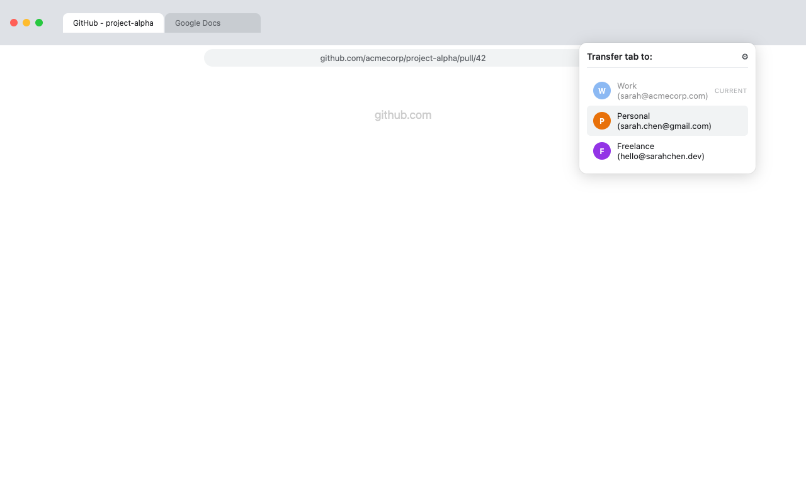
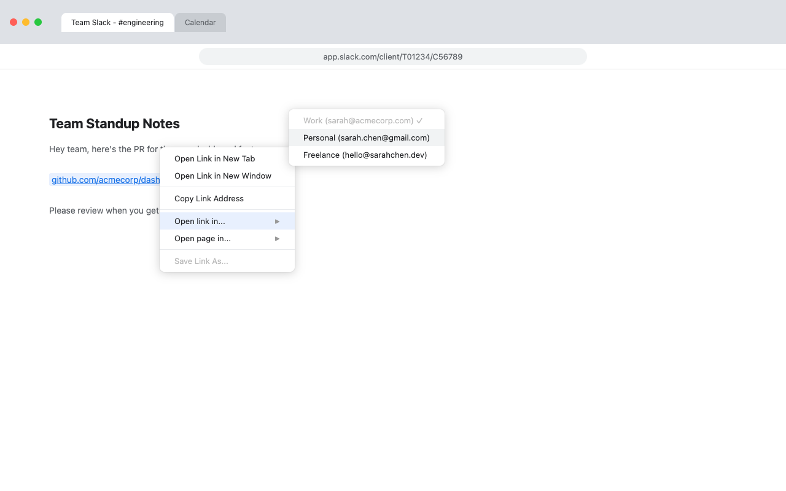

<p align="center">
  
</p>

<h1 align="center">Profilissimo</h1>

<p align="center">
  <strong>Open any tab or link in a different Chrome profile with one click.</strong>
</p>

<p align="center">
  <a href="#installation">Installation</a> ·
  <a href="#usage">Usage</a> ·
  <a href="#building-from-source">Build from Source</a>
</p>

---

## Why Profilissimo?

If you juggle multiple Chrome profiles (work, personal, client accounts), you already know the pain: links open in the wrong profile, and "Switch profile" just opens a blank window. You end up copying the URL, switching profiles, pasting, and closing the old tab. Repeatedly.

Profilissimo eliminates that workflow entirely. Right-click a link, pick a profile, done.

## Features

- **Toolbar popup** to view all Chrome profiles and transfer the current tab
- **Context menus** to open any page or link in a specific profile via right-click
- **Keyboard shortcut** (`Alt+Shift+P`) for instant transfer to a default profile
- **Auto-close** option to close the source tab after transfer

> **Platform support:** macOS only. Linux and Windows support is planned.

<p align="center">
  
  &nbsp;&nbsp;
  
</p>

## How It Works

Chrome extensions are sandboxed — they cannot launch other profiles directly. Profilissimo bridges this gap with a **Native Messaging Host (NMH)**, a lightweight local binary that the extension communicates with over Chrome's [native messaging protocol](https://developer.chrome.com/docs/extensions/develop/concepts/native-messaging) (4-byte length-prefixed JSON over stdin/stdout).

```
┌─────────────────────┐         ┌──────────────────────┐         ┌───────────────────────────┐
│   Chrome Extension  │  stdio  │     NMH Binary       │  spawn  │        Chrome             │
│                     │────────▶│                      │────────▶│  --profile-directory=...  │
│  (sends JSON msg)   │         │ (validates & routes) │         │  -- <url>                 │
└─────────────────────┘         └──────────────────────┘         └───────────────────────────┘
```

**End-to-end flow:**

1. User right-clicks a page or link and selects a target profile (or uses the popup/keyboard shortcut).
2. The service worker sends a JSON message to the NMH: `{ action: "open_url", url: "https://...", targetProfile: "Profile 2" }`.
3. The NMH validates the request (URL scheme, profile name format).
4. The NMH spawns a new Chrome process with `--profile-directory="Profile 2" -- <url>`.
5. The NMH writes `{ success: true }` back to the extension.
6. The extension optionally closes the source tab.

### Architecture in Detail

The system is an npm workspaces monorepo with two packages: `extension/` and `native-host/`.

#### Chrome Extension (`extension/`)

Built with Vite + `@crxjs/vite-plugin`. Four entry points:

- **Service worker** (`src/background/service-worker.ts`) — The central hub. Builds right-click context menus listing your Chrome profiles, handles keyboard shortcuts, and routes messages between the popup/options UI and the NMH. In Manifest V3, service workers are terminated after ~30 seconds of idle, so context menus are rebuilt on every wake.

- **Popup** (`src/popup/`) — The toolbar panel that appears when you click the extension icon. Displays all discovered Chrome profiles as a clickable list for one-click tab transfer.

- **Options** (`src/options/`) — Settings page where you configure your default profile, toggle auto-close, and manage notifications.

- **Onboarding** (`src/onboarding/`) — A first-run setup guide shown automatically on install.

Key utilities in `src/utils/`:
| File | Purpose |
|------|---------|
| `native-messaging.ts` | NMH communication with 15-second timeout |
| `storage.ts` | Chrome storage wrapper for user preferences |
| `url.ts` | URL validation (scheme checks, flag injection prevention) |
| `profiles.ts` | Profile list fetching and caching |

#### Native Messaging Host (`native-host/`)

Compiled to a standalone binary with Bun. The NMH has a simple lifecycle: read one message from stdin, handle it, write one response to stdout, then exit.

- **`main.ts`** — The message loop. Reads a 4-byte length header followed by a JSON payload from stdin, dispatches to the appropriate handler, and writes the response back using the same wire format.

- **`schema.ts`** — Validates all incoming messages. Only five actions are accepted: `open_url`, `list_profiles`, `health_check`, `get_config`, `set_config`.

- **`profiles.ts`** — Discovers Chrome profiles by reading the `Local State` JSON file where Chrome stores profile metadata (name, email, avatar).

- **`launcher.ts`** — The core action: locates the Chrome executable on disk and spawns a new detached process with `--profile-directory` and the target URL.

- **`config.ts`** — Reads and writes user configuration at `~/.profilissimo/config.json`.

#### Message Types

Defined in `extension/src/types/messages.ts`. The `NMHRequest` type is a [discriminated union](https://www.typescriptlang.org/docs/handbook/2/narrowing.html#discriminated-unions) on the `action` field — TypeScript can narrow the type in `switch` statements so each branch knows exactly which fields are available.

## Installation

### Step 1: Install the Extension

Install from the [Chrome Web Store](https://chromewebstore.google.com/detail/profilissimo/olhphbhieleagngagocedaildgefdmni) or load it manually:

1. Clone this repo and build the extension (see [Building from Source](#building-from-source))
2. Open `chrome://extensions` in Chrome
3. Enable **Developer mode** (toggle in the top right)
4. Click **Load unpacked** and select the `extension/dist` folder
5. Note your extension ID (shown under the extension name)

### Step 2: Install the Native Messaging Host

The NMH is a standalone binary that Chrome launches when the extension needs it.

**Option A: Download a pre-built binary**

Download the binary for your platform from the [latest release](https://github.com/lectops/profilissimo/releases/latest):

| Platform             | Binary                            |
| -------------------- | --------------------------------- |
| macOS (Apple Silicon) | `profilissimo-nmh-darwin-arm64`  |

Then register it with Chrome (Step 3).

**Option B: Build from source**

See [Building from Source](#building-from-source).

### Step 3: Register the NMH with Chrome

Chrome requires a JSON manifest to locate the NMH binary and authorize the extension to use it.

```bash
mkdir -p "$HOME/Library/Application Support/Google/Chrome/NativeMessagingHosts"

cat > "$HOME/Library/Application Support/Google/Chrome/NativeMessagingHosts/com.profilissimo.nmh.json" << EOF
{
  "name": "com.profilissimo.nmh",
  "description": "Profilissimo Native Messaging Host",
  "path": "/absolute/path/to/profilissimo-nmh",
  "type": "stdio",
  "allowed_origins": [
    "chrome-extension://YOUR_EXTENSION_ID/"
  ]
}
EOF
```

> **Important:** Replace `/absolute/path/to/profilissimo-nmh` with the actual binary path and `YOUR_EXTENSION_ID` with the ID from Step 1.

### Step 4: Restart Chrome

Quit Chrome completely (`Cmd+Q`) and reopen it. Chrome only detects new native messaging hosts on startup.

### Step 5: Verify

Click the Profilissimo icon in the toolbar. If your Chrome profiles appear in the list, installation is complete.

## Usage

### Popup

Click the Profilissimo icon in the toolbar. Your Chrome profiles appear in a list. Click one to open the current page in that profile.

### Context Menu

Right-click any page or link. Under **"Open this page in..."** or **"Open link in..."**, select the target profile.

### Keyboard Shortcut

Press `Alt+Shift+P` to transfer the current tab to your default profile. Set the default in **Settings** (gear icon in the popup). Customize the shortcut at `chrome://extensions/shortcuts`.

### Settings

Click the gear icon in the popup or visit the extension's options page:

| Setting              | Description                                        |
| -------------------- | -------------------------------------------------- |
| **Default profile**  | Profile used by the keyboard shortcut              |
| **Close source tab** | Automatically close the tab after transfer         |
| **Show notifications** | Display a notification on successful transfer    |

## Building from Source

### Prerequisites

- [Node.js](https://nodejs.org/) >= 18
- [Bun](https://bun.sh/) (for compiling the NMH binary)
- npm (included with Node.js)

### Build Everything

```bash
git clone https://github.com/lectops/profilissimo.git
cd profilissimo
npm install
npm run build
```

This compiles the extension (to `extension/dist/`) and the NMH (to `native-host/dist/`).

### Build the Extension Only

```bash
npm run build:extension
```

Output: `extension/dist/`. Load this folder as an unpacked extension in Chrome.

### Build the NMH Binary

```bash
npm run build:binary -w native-host
```

Output: `native-host/bin/profilissimo-nmh`.

### Development

```bash
npm run dev    # Vite dev server with hot reload for the extension
```

Load `extension/dist/` as an unpacked extension. Vite rebuilds on file changes.

For the NMH during development, run it directly with Node instead of compiling:

```bash
node native-host/dist/main.js
```

## Project Structure

```
profilissimo/
├── extension/                 # Chrome extension (Manifest V3)
│   ├── src/
│   │   ├── background/        # Service worker (context menus, message routing)
│   │   ├── popup/             # Toolbar popup UI
│   │   ├── options/           # Settings page
│   │   ├── onboarding/        # First-run setup guide
│   │   ├── types/             # Shared TypeScript interfaces
│   │   └── utils/             # Helpers (NMH communication, storage, formatting)
│   ├── public/                # Static assets (manifest.json, icons)
│   └── dist/                  # Build output (load this in Chrome)
├── native-host/               # Native Messaging Host
│   ├── src/
│   │   ├── main.ts            # Stdin/stdout message loop
│   │   ├── schema.ts          # Request validation
│   │   ├── profiles.ts        # Chrome profile discovery
│   │   └── launcher.ts        # Chrome process spawning
│   └── bin/                   # Compiled binaries (gitignored)
├── installer/                 # Install scripts
│   └── install.sh             # macOS
└── .github/workflows/         # CI/CD (release on tag push)
```

## Security

- Only `http:` and `https:` URLs are accepted. `javascript:`, `file:`, and `data:` schemes are rejected.
- Profile directory names are validated against `/^[a-zA-Z0-9 _-]+$/` to prevent argument injection.
- URLs starting with `-` are rejected to prevent Chrome CLI flag injection.
- The NMH manifest restricts communication to authorized extensions via `allowed_origins`.
- All messages from the popup and options pages are validated before processing.
- NMH responses are validated at the extension boundary before use.
- No data leaves your machine. Everything runs locally between the extension and the NMH binary.

## License

MIT
